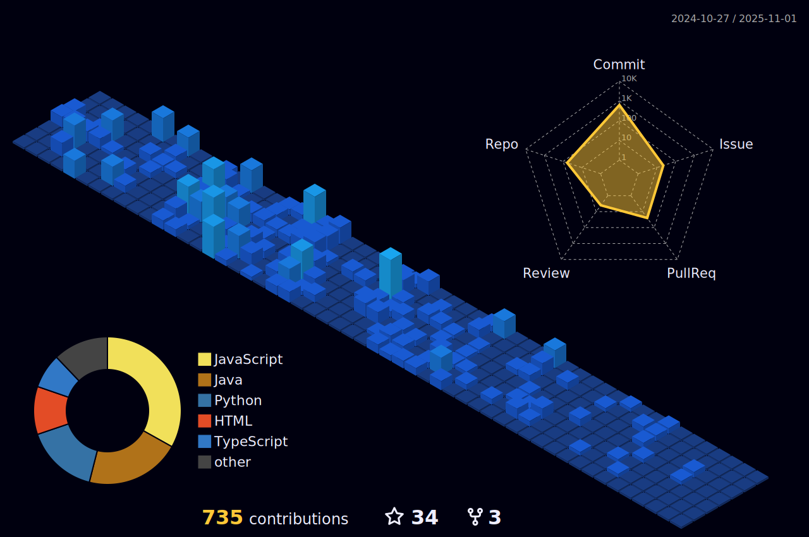

# 👋 Jack (@jackh54)

I'm a developer focused on building modern web applications with clean, scalable architecture.

---

### 🧠 Current Focus

* Frontend development (React, JavaScript, TypeScript)
* Backend development (Java, Node.js)

---

### 🤝 Open to Collaboration On

* Open-source projects
* Full-stack applications
* Tools for developers

---

### 📫 Contact

**Email:** [contact@pandadevv.dev](mailto:contact@pandadevv.dev)
**Website:** [pandadevv.dev](https://pandadevv.dev)

---

### ⚙️ Tools & Technologies

---

### 📊 GitHub Stats

  
   

